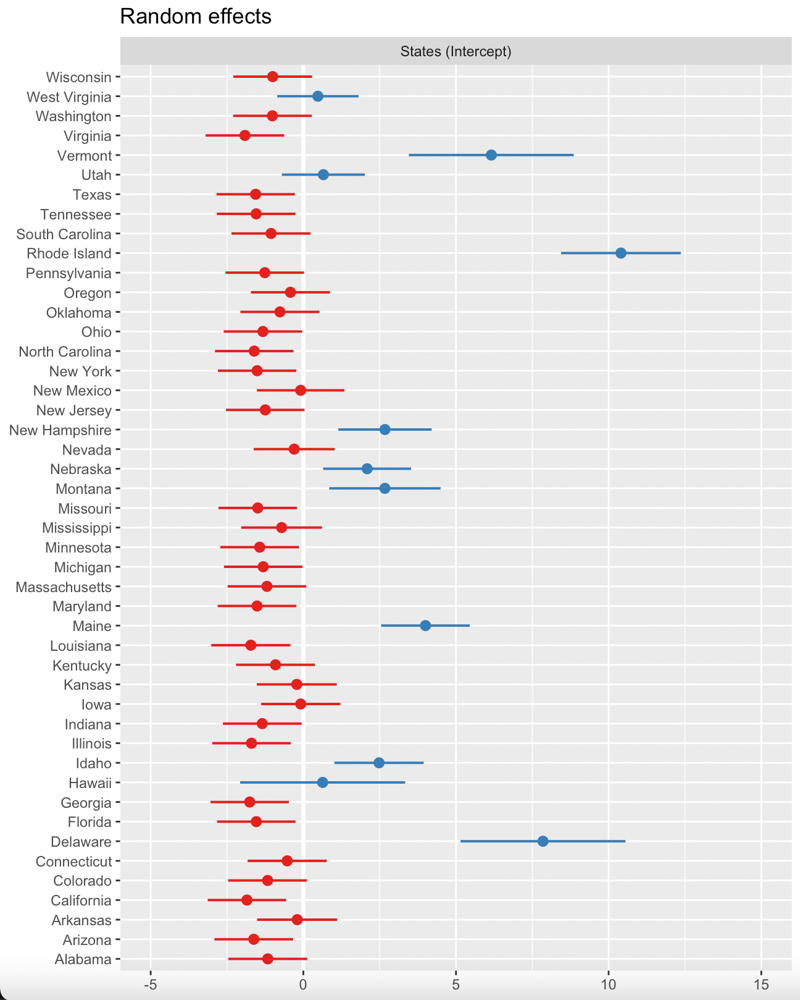
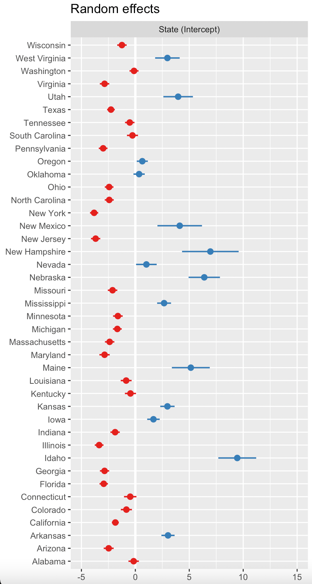

```{r setup, include=FALSE, message=FALSE}
knitr::opts_chunk$set(echo = FALSE)
source("glioblastoma_regression.R")
```

## Abstract  

In this project, I observed the relationship between glioblastoma cancer incidence and mortality rates depending on age, confirming that there is a bimodal distribution, with a peak at baby age and another at older age. I obtained a mixed effects model, conditioned on age grouping, year, and region in the United States. Incidence rate slowly decreases over time on average, but death rate does not change. This could be because of the aging population; fewer incidences and more elderly dying, though one would expect that, with the development of newer cancer therapy, that this would not be the case. There are also some interesting state and regional trends that do not correspond with anything found in literature, and I concluded that the states with lower population also have a higher elderly population, leading to such high incidence rates.      
  
## Introduction  
  
Cancer is a disease in which cells begin to rapidly proliferate abnormally. These cells can form clumps called tumors, which can progressively become deadly as it grows if located in a vital organ such as the lungs or the brain. Glioblastoma is an aggressive type of cancer that targets the central nervous system, which includes the brain and spinal cord. The median age of glioblastoma diagnosis is 61; however, the most common solid tumors that affect children are glioblastoma tumors.  
To investigate this phenomena, I wanted to look at the incidence and mortality rates for different age groups. From the CDC WONDER cancer statistics database, I obtained demographic information and the relevant cancer counts and rates, grouped by year from 1999-2018, and US state. I hypothesized that mortality rates may be different between the younger and older age groups, and that these rates could show a time-dependent trend. There may also be a difference in rates across different states; higher populated states with a greater biomedical research impact may see a decrease in mortality rates with new cancer research, and the other states may lag behind as the technology gets distributed. I look to investigate all these relationships.  
  
## Method  
### Data Visualization
I performed basic EDA to quickly surmise the visible trends in the data. I plotted the incidence rate by age group and faceted by year, shown below. For non-faceted visualization, see Appendix.  
  
```{r}
plot_inc
plot_death
```
  
As expected from literature, in the incidence rate graph, there is a local peak at a very young age, then a tapering in the middle of life, then an increase as one gets older. There is an outlier, corresponding to an extremely high incidence count in Rhode Island in 2003 in 80-84 year-olds. There was nothing in literature research indicating abnormality in Rhode Island in that time, so this may be a clerical error, or something that simply was not reported upon by media. In the mortality rate graph, we see a slightly different trend, of fewer young children dying from glioblastoma compared to a high rate in older people.   
  
I also looked at the distribution of glioblastoma rates by regions of the US. The non-faceted plot is in the Appendix, along with the incidence rate plot as, and the following plot of mortality has been faceted by year for easier visualization of each individual region by year (se bands removed for clarity). 
  
```{r}
region_death_plot
```
   
Generally, the West and the South are the two regions with the highest death rates. They even increase over time, which was a surprising trend, as you would expect with advancing technology we would be getting better at treating cancer.    

### Modeling  
  
Though I knew from EDA that there is a distribution that is not Gaussian or Poisson, I began with simple linear regressions with crude rates as the outcome and different combinations of year, states, and/or age groups as predictors. The resulting diagnostic plots showed trends in the residuals and non-normality. The posterior prediction did not capture the data trends. Therefore, I moved to mixed effects models for correlated data. I settled on using the predictors age group, state, and year, with state as the grouping.      
  
  
## Results  
  
The final mixed effects models for glioblastoma incidence included the square root transformation of the predictor age group to account for unconventional data distribution mentioned above. This would scale the higher ages down, so that the linear age group predictor would not underestimate the peak at the younger age.  
I found that the intercept for the states (random effect) ranged from values of approximately -2 to 10. Interestingly, the areas with the lowest populations compared to the rest of the United States generally had a higher intercept, meaning a higher baseline incidence rate of glioblastoma.  
  
{width=200px, height=400px} {width=400px, height=400px}    
  

  
  
For full model details and numerical values, see Appendix.    
With the model, I obtained predicted values for the observed and death data.  
  
```{r}
grid.arrange(lmer_inc_plot, lmer_death_plot, ncol = 2)
```
  
The heteroskedasticity dictates that the model could further be improved.    
  
## Discussion  
  
The results obtained were mixed and/or unexpected. I observed that the mortality rate does not decrease over the years, and it is unclear why. There were also unexpectedly high glioblastoma rates for some states, such as Rhode Island mentioned before. Literature search does not reveal any cancer-related phenomena in these states in the respective years. Delaware has no death rate information, but it has the highest incidence rate intercept. I would be interested to see mortality trends. Similarly, Hawaii, Montana, Rhode Island, and Vermont also all have moderate to high incidence rate intercepts but no information on death rate. This could be because these states generally house older populations. The younger generation tends to flock to cities within states of large population, such as California and New York, skewing the glioblastoma incidence rates because young people, as we've seen, have a low incidence rate in general.    
The model was able to capture the general trend, but there is heteroskedasticity with increasing age. Though I attempted to control for this with age group predictor transformation, this may simply come down to an intuitive reason that some states have a generally higher population of elderly, and we observed that increasing age corresponds to increasing risk of glioblastoma. Therefore, it makes sense that there is some spread. Next steps may be to dive further into investigating the age demographics of states over the years.    

In regards to the data itself and the limitations posed, there was only a little over 13000 observations, once I cleaned the data of null values and only extracted glioblastoma, the cancer of interest. This may contribute to some uneven data, not missing completely at random, but there was no reasoning posted on the database website. From the map shown below in the appendix, it seems that the extremely lowly-populated states often missed data, which makes sense.  


\newpage

## Appendix  
  
### Data Cleaning
The CDC database allows one to request incidence or mortality data grouped by different factors, such as race, age group, year, state, and type of cancer. I manipulated the data frame to add a code to age groups (e.g. turning "1-4 years" into "1"), obtained the crude rate (i.e. count/population, in the scale of 10^-5) and the respective standard error. The database had an option to request mortality rate data; however, it was not grouped by age and there were far fewer observations, so the incidence and death data was obtained and manipulated separately. Furthermore, some states did not have complete counts over the years, so I focused on US regions (Midwest, Northeast, South, and West), but you may see maps below.  
  
```{r}
visual_map
```
  
This is an example of glioblastoma incidence rates (crude rate 10^-5) in 2017 across the states. The excluded states (North Dakota, South Dakota, and Wyoming), are missing data. The pooled incidence rates look generally similar across the US, except a few states in the NorthWest and in the NorthEast. These were confirmed in the results section.   
  
Here are some additional visualization plots. The following shows the combined points (non-faceted version of first figure in Data Visualization section) for general incidence and death rates by year and by age.  
```{r}
grid.arrange(plot_inc,plot_death, ncol = 2)
``` 
   
This is the combined points (non-faceted version) for general incidence and death rates by year and by Region in the US.  
  
```{r}
grid.arrange(mean_region_plot, mean_death_plot, ncol = 2)
```
  
It seems that the Northeast has the highest incidence rates in general, followed by the Midwest, then the South, then the West. We see that generally the rates decrease over the years for the West and South.  
  
The different models tried and their respective diagnostic plots are in the "glioblastoma_regression.R" file, for reference.  
  
Here are the model details for the final models.   
  
For the incidence rate:  
```{r}
print(fit, digits=2)
fixef(fit)
ranef(fit)
```
  
For the death rate:  
```{r}
print(fitb, digits=2)
fixef(fitb)
ranef(fitb)
```
  
  
  
```{r}
lmer_inc_diagnostic
```
  
This plot using our final model. It depicts the prediction of brain incidence plotted against age group, which corresponds to the original EDA. The general shape is similar; however, we see more and more deviation with the higher age groups, and the younger age is also over-estimated. 
  